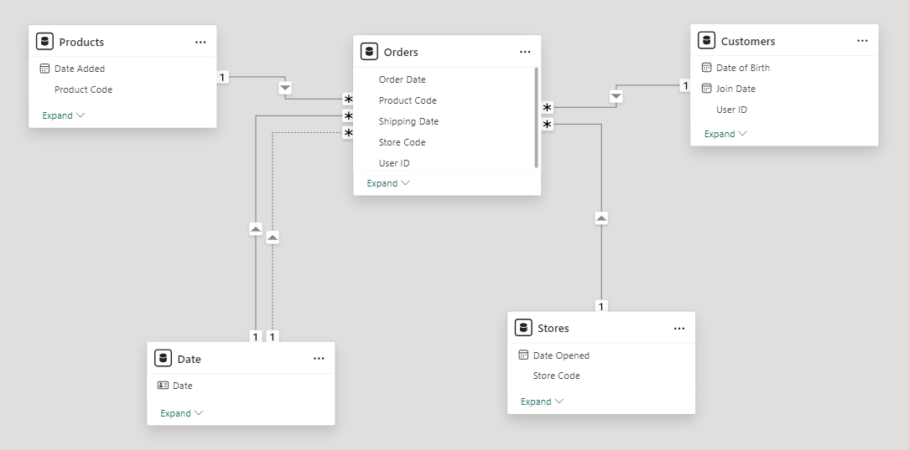

# Data Analytics Power BI Report

_Started on 10/12/2024_

This project was the second project set by AICore as part of the Data Analytics pathway. This project had a stronger focus on the visualisation aspect of data analysis, more specifically, Power BI. It involved importing data from several sources into Power BI, then cleaning the tables seperately based on what was appropriate for the table, creating measures and new tables from the existing data before finally collating everything into a visualisation the can be presented to those it would concern. This project also had a step of querying the data in SQL to cater to those clients who wouldn't have direct acccess to specialised visualisation tools like Power BI, so we can give them an overarching dissemination of the key data that they can get relevant information from without looking at the specialised visualisations.

## Scenario
You have recently been approached by a medium-sized international retailer who is keen on elevating their business intelligence practices. With operations spanning across different regions, they've accumulated large amounts of sales from disparate sources over the years.

Recognizing the value of this data, they aim to transform it into actionable insights for better decision-making. Your goal is to use Microsoft Power BI to design a comprehensive Quarterly report. This will involve extracting and transforming data from various origins, designing a robust data model rooted in a star-based schema, and then constructing a multi-page report.

The report will present a high-level business summary tailored for C-suite executives, and also give insights into their highest value customers segmented by sales region, provide a detailed analysis of top-performing products categorised by type against their sales targets, and a visually appealing map visual that spotlights the performance metrics of their retail outlets across different territories.

## Files 

- `data_analytics_report.pbix`: The Power BI report.
- `sql_queries`: The queries for the business questions provided.
- `csv_queries`: The results for the aforementioned queries.
- `table_columns_info`: Information relating to the tables, the columns they contain and the datatypes of the columns.

## Project Outline

1. Import the Data into Power BI.
    - This part of the project involved importing data from various sources into Power BI.
    - These included connecting to:
        - An Azure SQL Database
        - A Microsoft Azure Storage account
        - Several web-hosted CSV files
    - From the aforementioned data sources we had our 4 tables:
        - Orders 
        - Products dimension
        - Stores dimension
        - Customers
2. Create the star-schema data model.
    - To create a star-shaped model, a 5th table would need to be created.
    - Using DAX, a continuous date table was created, capitalising on the time intellingence functions of Power BI. Several columns were added to streamline our later functions. 
    - The star-shaped model looks like the following:
    
    - Heirarchies were also created in the date and geographical tables to facilitate drill-down in the charts we will go on to include in our report.
3. Building the report.
    - The report consists of several pages:
        - Customer Detail:
            - This page focuses on analysis on the customer level.
            - 
        - Executive Summary:
            - Provides an executive level summary which gives an overview of the company's performance as a whole.
            - 
        - Product Detail:
            - Provides an in-depth breakdown of performance of the products held in inventory with options to filter by product and region.
            - 
        - Stores Map:
            - Responsible for giving a geographical overview of all the stores in different region allowing for the user to narrow down on a specific region.
            - 
            - Used with a stores tooltip which allows for a look on YTD profit performance vs target, available on hover over a specific store.
            - 
        - Stores Drillthrough:
            - Makes it easy for managers to track progress of a given store, providing a summary of each stores performance. 
            - 
4. SQL querying.
    - This milestone was to accomodate for those users outside of the company, especially for those who will not have access to tools like Power BI. 
    - This focused on answering several business related questions that would allow us to snapshot most of the critical information one would see when viewing the report, without actually having those visuals on hand.
    - These results were stored as both, a CSV and the SQL query.

## Installation Instructions

To run this project several tools are required:

- Power BI
- VSCode
- SQLTools extension within VSCode

## License 

This work is licensed under a Creative Commons Attribution-NoDerivs 4.0 International License.  
To view a copy of this license, visit https://creativecommons.org/licenses/by-nd/4.0/
